# Описание сценария

Последовательность действий нарушителя следующая:

1) Внутренний нарушитель подбирает пароль на файловый сервер и меняет существующий на сервере файл другим файлом с backdoor (дефектом алгоритма).

2) Пользователь Dev-1 загружает и запускает файл с backdoor.

3) Внутренний нарушитель получает контроль над компьютером пользователя Dev-1 и загружает скрипт для похищения учетных данных из браузера. Запускает данный скрипт и получает логин - пароль к Redmine.

4) Внутренний нарушитель проводит атаку stored XSS для включения на Redmine сервере REST API. Вредоносный код записывается на Wiki-страницу проекта Dev1. Получив доступ к консоли администратора, внутренний нарушитель создает нового пользователя Redmine с правами администратора.

5) Внутренний нарушитель ожидает, когда администратор просмотрит страницу с внедренным вредоносным кодом.

6) Внутренний нарушитель проводит Blind SQL-инъекцию, получает доступ к данным конфиденциального проекта.

Ниже представлена логическая схема сценария № 5 «Защита научно-технической информации предприятия», красными стрелками обозначены вредоносные действия нарушителя, а зелеными - легитимные действия любого пользователя (рис. [-@fig:001]).

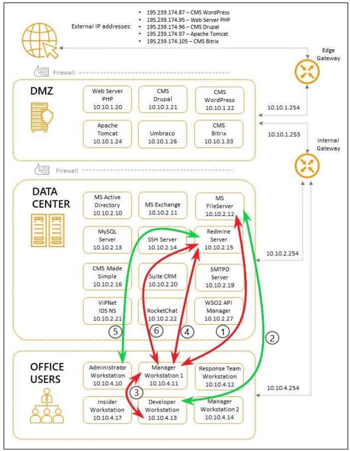{#fig:001 width=90%}

# Перечень уязвимостей и последствий

Для сценария № 5 «Защита научно-технической информации предприятия» определены три уязвимости и два последствия:

1) Уязвимость 1. Слабый пароль пользователя.

2) Последствие. Developer backdoor.

3) Уязвимость 2. XSS (CVE-2019-17427).

4) Последствие. Redmine User.

5) Уязвимость 3. Blind SQL (CVE-2019-18890).

## Уязвимость 1. Слабый пароль пользователя.

На файловом сервере установлен слабый пароль для входа, что позволяет нарушителю перебрать данный пароль со словарем. После успешной авторизации на файловом сервере нарушитель загружает .bat файл и получает доступ к учетным данным пользователя dev1.

**Решение:** для закрытия уязвимости необходимо изменить пароль на более сложный, не содержащийся в словаре. Для изменения пароля на сервере AD открыть «Active Directory Users and Computers», найти пользователя dev1, нажать на «Reset Password» (Рисунок 2) и ввести новый пароль.(рис. [-@fig:002]).

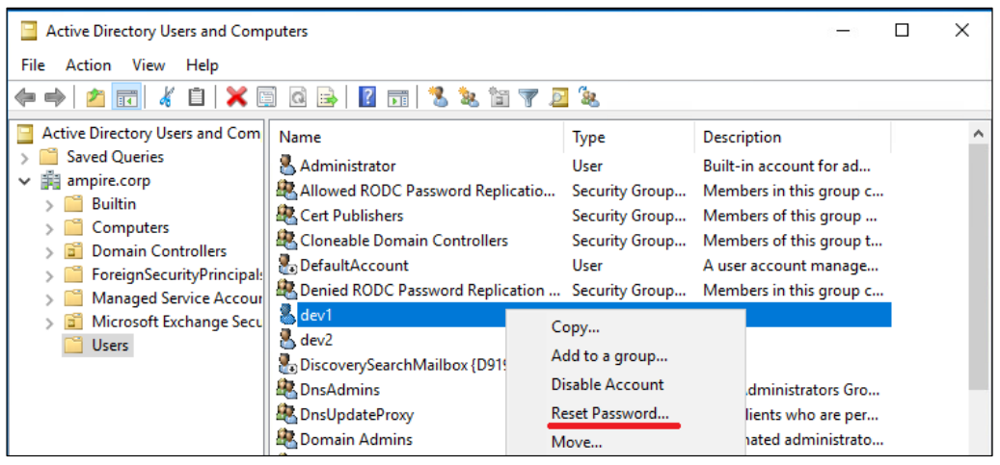{#fig:002 width=90%}

После изменения пароля пользователя dev1 уязвимость успешно устранена.(рис. [-@fig:003]).

{#fig:003 width=90%}

Что было сделанно:

1) Переходим на удаленный рабочий стол для измененя пароля пользователя «10.10.2.10 - Remote Desktop Connection» (рис. [-@fig:017]).

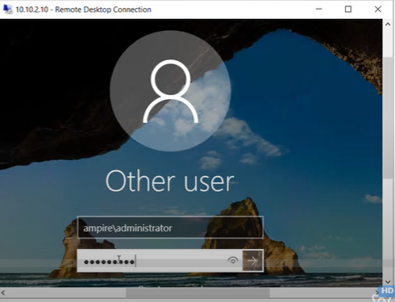{#fig:017 width=90%}

2) Окно Active Directory Users and Computers развёрнуто дерево ampire.corp -> Users; в списке - Administrator, Allowed RODC Password Replication, Cert Publishers, CloneableDomainControllers, DefaultAccount, dev1, dev2, DiscoverySearchMailbox, DnsAdmins и т.д.(рис. [-@fig:051]).

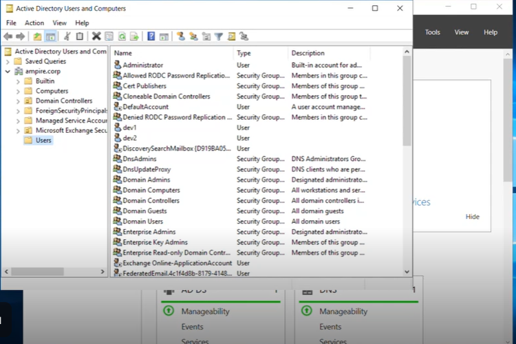{#fig:051 width=90%}

3) Правым кликом вызвано контекстное меню, выбран пункт «Reset Password…» -> открылось одноимённое модальное окно с полями «New password», «Confirm password», флажком «User must change password at next logon» и статусом «Account Lockout Status on this Domain Controller Unlocked». В поле New password вводится новый пароль (9 символов).(рис. [-@fig:019]).

{#fig:019 width=90%}

## Последствие. Developer backdoor.

Нарушитель может создать сервис, автоматически запускающий исполняемый файл, который устанавливает Reverse Shell подключение. Новая задача, записанная нарушителем, находится на узле Developer 1 (10.10.4.13) в планировщике задач. (рис. [-@fig:004]).

{#fig:004 width=90%} 

В созданной задаче можно обнаружить запуск файла во вкладке «Action» svchosting.exe (рис. [-@fig:005]).

{#fig:005 width=90%} 

Для устранения полезной нагрузки необходимо удалить задачу из планировщика задач и файл из директории.

Что было сделанно:

1) Новое RDP‑подключение к Developer Workstation 1 (10.10.4.13) (рис. [-@fig:020]).

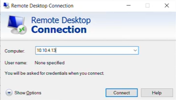{#fig:020 width=90%}

2) Открыть Task Scheduler, вкладка Task Scheduler Library в списке заданий - «Evil task» (рис. [-@fig:021]).

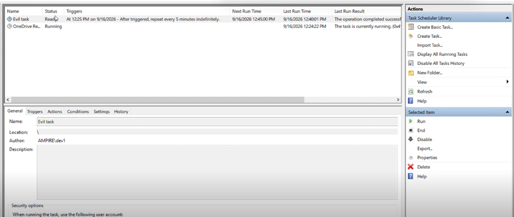{#fig:021 width=90%}

3) «Evil task» -> контекстное меню Run  End  Disable  Export…  Properties  Delete - выбирается пункт Delete, задание удаляется из библиотеки планировщика.(рис. [-@fig:022]).

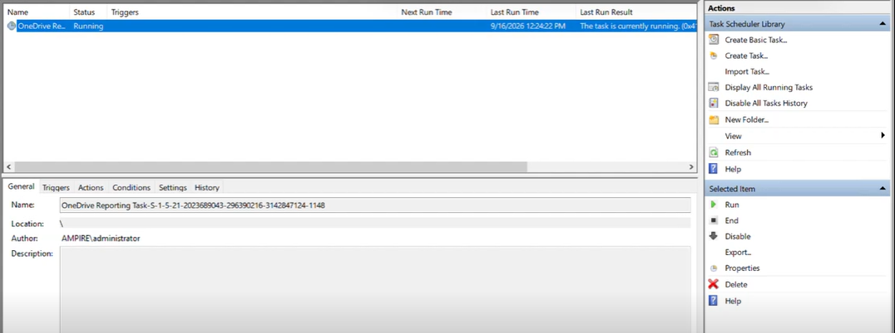{#fig:022 width=90%}

4) Открываем File Explorer, путь This PC -> Downloads в папке два файла - legacy.exe и svchosting.exe. Файл svchosting.exe удаляется, остается только legacy.exe(рис. [-@fig:023]).

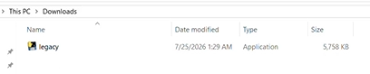{#fig:023 width=90%}

5) Проверяем что последствие «Dev backdoor» зафиксировано платформой как устранённое.(рис. [-@fig:024]).

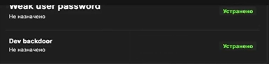{#fig:024 width=90%}

## Уязвимость 2. XSS (CVE-2019-17427).

Эксплуатируемая уязвимость - CVE-2019-17427.

В Redmine до версии 3.4.11 и 4.0.x до версии 4.0.4 постоянный XSS существует из-за ошибок форматирования при работе с textile текстом. В данном сценарии используется для включения REST API для эксплуатации следующей уязвимости (рис. [-@fig:007]), (рис. [-@fig:008]),(рис. [-@fig:009]).

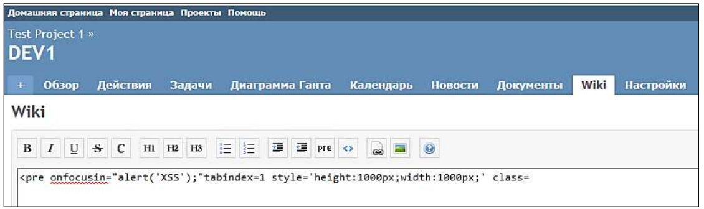{#fig:007 width=90%} 

{#fig:008 width=90%} 

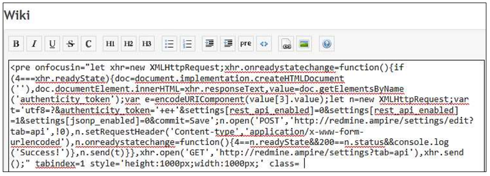{#fig:009 width=90%} 

**Решение:** внести изменения в код Redmine.

Необходимо найти обработку текста wiki-страницы при наличии в тексте html-тегов. Из описания уязвимости понятно, что необходимо найти библиотеку для преобразования textile разметки в html. В Redmine за данное преобразование отвечает Redcloth (файл redcloth3.rb в папке /var/www/redmine/lib). В redcloth3.rb представляют интерес следующие строки (рис. [-@fig:010]).

{#fig:010 width=90%} 

Далее можно удалить тег pre из разрешенных тегов, которые не будут экранированы. Необходимо рассмотреть закрытие уязвимости разработчиками - в репозитории Redmine на Github зайти в Releases и сравнить исправленную версию с уязвимой. В файле redcloth3.rb разработчики внесли следующие изменения (рис. [-@fig:011]), (рис. [-@fig:012]),(рис. [-@fig:013]).

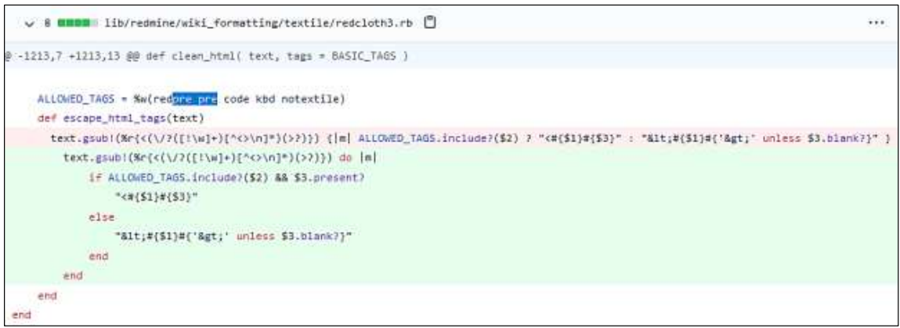{#fig:011 width=90%} 

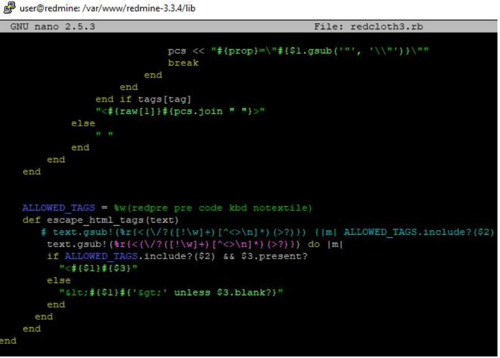{#fig:012 width=90%} 

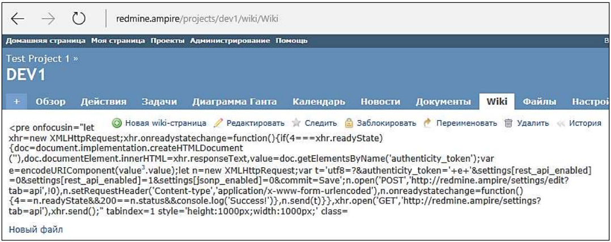{#fig:013 width=90%}

После внесения изменений необходимо перезапустить службу веб-сервера: sudo systemctl restart nginx.service.

Что было сделанно:

1) Через терминал SSH‑подключение к серверу Redmine (10.10.2.15), рабочая директория varwwwredminelib; в nano открыт файл redcloth3.rb и редактируем.(рис. [-@fig:025]), (рис. [-@fig:026]).

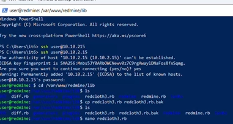{#fig:025 width=90%} 

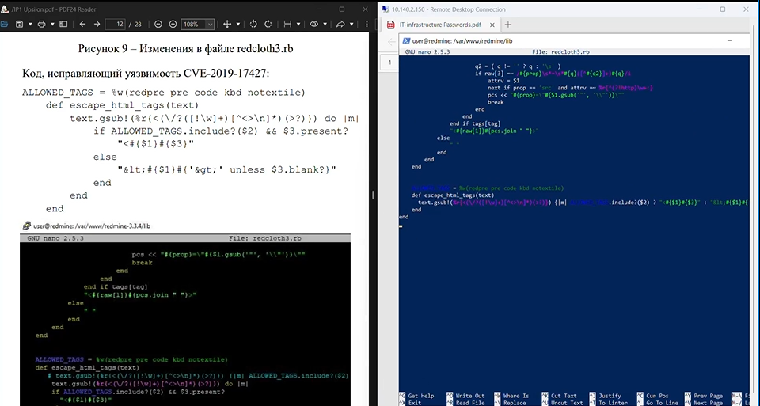{#fig:026 width=90%} 

исходная строка text.gsub!(%r{(([!w]+)[^n])()}) {m ALLOWED_TAGS.include($2)  #{$1}#{$3}  &lt;#{$1}#{'&gt;' unless $3.blank}} комментируется (добавляется # в начале строки); (рис. [-@fig:027]).

ниже дописывается новый блок кода

text.gsub!(%r{(([!w]+)[^n])()}) do m

  if ALLOWED_TAGS.include($2) && $3.present
  
    #{$1}#{$3}
    
  else
  
    &lt;#{$1}#{'&gt;' unless $3.blank}
  
  end
  
end

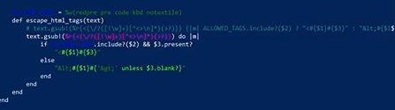{#fig:027 width=90%} 

2) sudo systemctl restart nginx.service — служба перезапущена.(рис. [-@fig:028]).

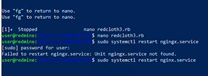{#fig:028 width=90%} 

3)  Переходим по правильному адресу и успешено заходим на web страницу, выполнен вход в консоль администратора Redmine. На сервере лабороторной работы, так же показывает положительный результат(рис. [-@fig:029]).

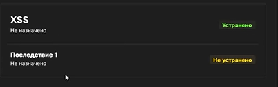{#fig:029 width=90%} 

## Последствие. Redmine User.

Данная полезная нагрузка заключается в том, что нарушитель создает пользователя на портале Redmine. Пользователь, обладающий правами администратора, имеет неограниченный доступ к пользовательской базе.

**Примечание:** способ закрытия полезной нагрузки «Redmine User» не будет действовать до внесения изменений по закрытию уязвимости «Атака XSS»

Для обнаружения добавления нового привилегированного пользователя, достаточно зайти в консоль администратора Redmine по ссылке (http://redmine.ampire.corp/login), перейти в раздел «Administration» - «Users» и посмотреть список существующих пользователей (рис. [-@fig:014]).

{#fig:014 width=90%} 

Для нейтрализации полезной нагрузки необходимо удалить созданного пользователя «hacker» через веб-интерфейс Redmine (рис. [-@fig:015]).

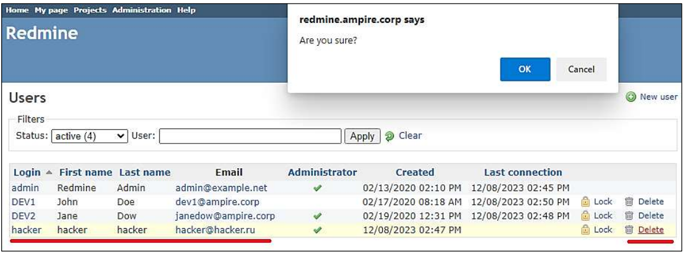{#fig:015 width=90%}

В результате удаления созданного пользователя «hacker» успешно нейтрализовано последствие Redmine User.

Что было сделанно:

1) В разделе Administration -> Users список пользователей admin, DEV1, DEV2, hacker (email hacker@hacker.ru, дата создания 16.09.2026 1225 PM, последнее подключение 1258 PM) — строка hacker подсвечена как посторонняя. (рис. [-@fig:030]).

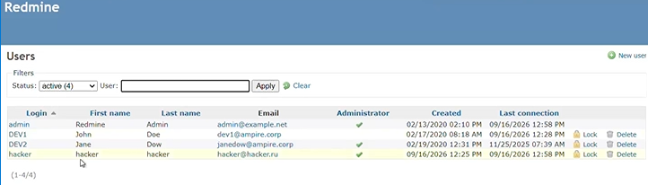{#fig:030 width=90%}

2) Удаляем hacker. По кнопке Delete в строке hacker вызывается подтверждающий диалог браузера «redmine.ampire.corp says Are you sure» с кнопками OKCancel; нажимается OK — учётная запись удаляется.(рис. [-@fig:031]).

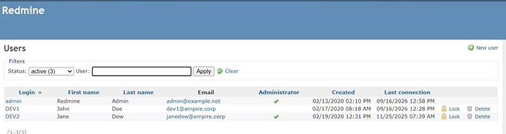{#fig:031 width=90%}

3) Переходим на сервер лабороторной работы. Последствие Redmine User устранено(рис. [-@fig:032]).

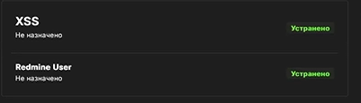{#fig:032 width=90%}

## Уязвимость 3. Blind SQL (CVE-2019-18890).

Эксплуатируемая уязвимость - CVE-2019-18890.

В Redmine до версии 3.2.9 и 3.3.x до версии 3.3.10 уязвимость позволяет пользователям Redmine получать доступ к защищенной информации с помощью сгенерированного объектного запроса. Уязвимость реализуется посимвольным перебором с замером времени ответа. В данном сценарии данная уязвимость используется для получения конфиденциальной информации из БД, минуя разграничение доступа Redmine (рис. [-@fig:016]),(рис. [-@fig:050]).

Время прихода пакета является индикатором: при запоздании пакета - символ подобран верно, иначе - перебор продолжается.

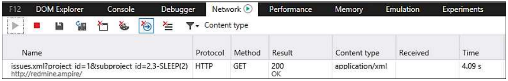{#fig:016 width=90%} 

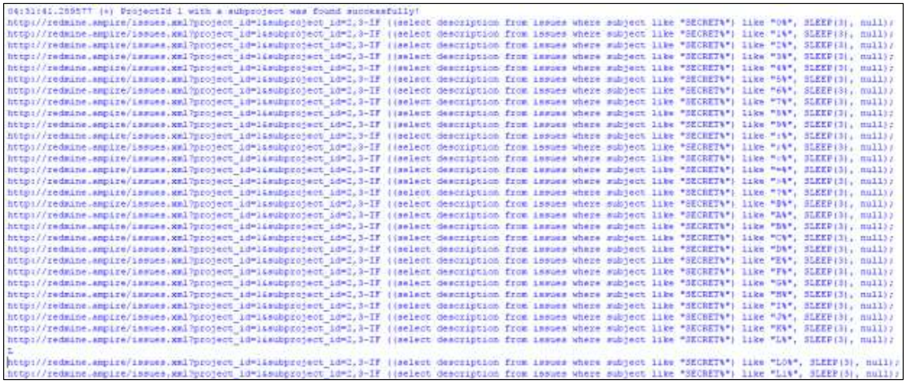{#fig:050 width=90%}

**Решение:** внести изменения в код Redmine.

Исходя из адреса и запроса следует найти местоположение скрипта, где происходит обработка параметра subproject_id. В данном случае рассмотрен файл query.rb. Данный файл находится в директории /var/www/redmine/app/models (рис. [-@fig:018]).

{#fig:018 width=90%}

Из вышеупомянутого рисунка следует, что выделенный участок кода отвечает за передачу значений в запрос в случае наличия параметра subproject_id. В данном случае следует добавить фильтрацию значений и закомментировать код.

После внесения изменений необходимо перезапустить службу веб-сервера: sudo systemctl restart nginx.service.

Что было сделанно:

1) Повторно выполняем SSH‑подключение к 10.10.2.15, переход в varwwwredmineappmodels; cp query.rb query.rb.bak; открытие query.rb в nano.(рис. [-@fig:033]).

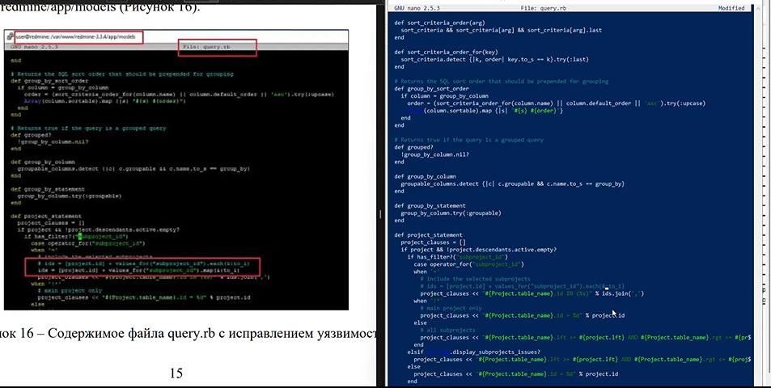{#fig:033 width=90%}

2) В методе project_statement вносится точечная правка

Строка ids = [project.id] + values_for(subproject_id).each(&to_i) комментируется;

Заменяется на ids = [project.id] + values_for(subproject_id).map(&to_i).

Суть исправления метод .each(&to_i) не изменяет содержимое массива (возвращает исходные, потенциально произвольные строковые значения), тогда как .map(&to_i) принудительно приводит каждое значение параметра subproject_id к целому числу, что и закрывает возможность подстановки SQL‑конструкций через этот параметр.(рис. [-@fig:034]).

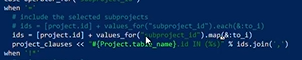{#fig:034 width=90%}

3) sudo systemctl restart nginx.service — служба перезапущена.(рис. [-@fig:035]).

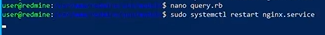{#fig:035 width=90%} 

4)  Переходим по правильному адресу и успешено заходим на web страницу, выполнен вход в консоль администратора Redmine. На сервере лабороторной работы, так же показывает положительный результат(рис. [-@fig:036]), (рис. [-@fig:037]).

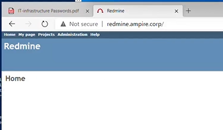{#fig:036 width=90%} 

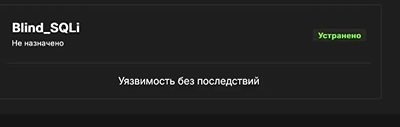{#fig:037 width=90%} 

# Мониторинг 

В процессе мониторинга, наша команда пыталась опрелить какие системы были затронуты нарушителем, что выдавало его присутствие большим числом откликов и связей между собой. У нас получилось установить 4 отчета мониторинга системы: от момета как нарушитель попал в систему, до описания всех уезвимостей что были в системе.

Помимо непосредственного устранения уязвимостей, в рамках лабораторной работы велась регистрация выявленных инцидентов информационной безопасности во вкладке «Инциденты» платформы Ampire. Источником данных для заполнения карточек инцидентов служили события, зафиксированные программно-аппаратным комплексом обнаружения вторжений ViPNet IDS NS.

## Анализ событий ViPNet IDS NS

В разделе «События» ViPNet IDS NS средствами фильтра было настроено отображение событий за последние 24 часа с возможностью уточнения по IP-адресу источника, порта, получателя, домена, MAC-адреса и страны (рис. [-@fig:038]).

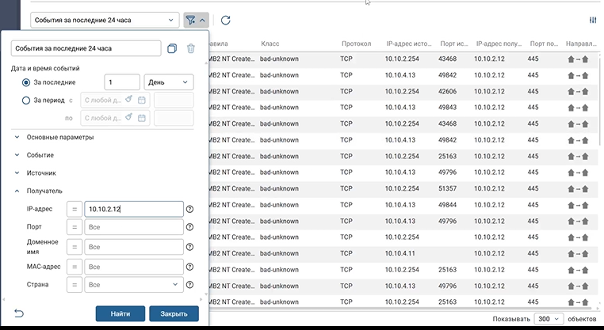{#fig:038 width=90%} 

В ходе анализа выявлена серия однотипных повторяющихся событий класса network-scan, зарегистрированных с интервалом около шести минут (рис. [-@fig:039]).

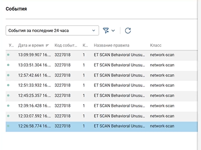{#fig:039 width=90%} 

Детальный просмотр одного из событий (12:26:58.774, 16.09.2026) показал следующие параметры: интерфейс захвата — eth2, протокол — TCP, тип события — сигнатурное, уровень важности — низкий, код события — 3227018. Соответствующее правило анализа — ET SCAN Behavioral Unusually fast Terminal Server Traffic Potential Scan or Infection (Inbound) var1 (класс network-scan, группа scan) — обнаруживает факт сканирования RDP-порта (рис. [-@fig:040]).

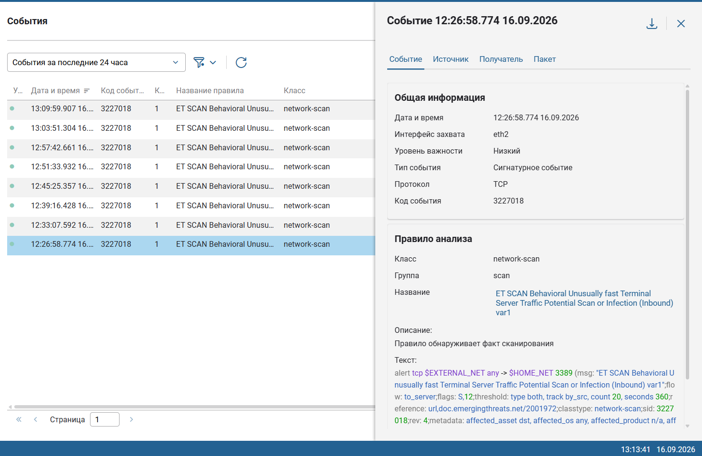{#fig:040 width=90%} 

Сопоставление источника и получателя данных событий показало, что сканирование велось с внешнего адреса 195.239.174.11 в адрес рабочей станции 10.10.4.11 на порт 3389 (RDP) (рис. [-@fig:041]).

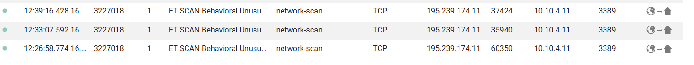{#fig:041 width=90%} 

Дополнительно был применён фильтр по получателю событий с IP-адресом 10.10.2.12 (MS FileServer). В результате обнаружена серия событий класса bad-unknown с сигнатурой SMB2 NT Create AndX Request…, источниками которых выступали адреса 10.10.2.254 и 10.10.4.13, порт назначения — 445 (SMB) (рис. [-@fig:042]).

{#fig:042 width=90%} 

Также в трафике, направленном на веб-сервер Redmine (10.10.2.15:80), зафиксированы события класса web-application-attack: AM EXPLOIT Generic Possi... и AM EXPLOIT Possible Red..., с источниками 10.10.2.254 и 10.10.4.11 (рис. [-@fig:043]).

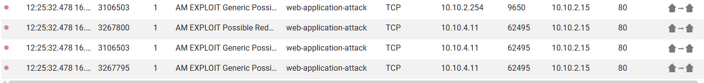{#fig:043 width=90%} 

## Регистрация инцидентов

На основании результатов анализа событий ViPNet IDS NS и сопоставления их со сценарием атаки (Сценарий №5) на платформе Ampire были зарегистрированы карточки инцидентов через форму «Добавление инцидента».

По результатам работы было зарегистрировано четыре инцидента, соответствующих этапам сценария атаки:

Инцидент 1. «Атака на Manager Workstation 1 на базе Developer» (автор — Жукова Арина, 16.09.2026 12:25). Описание: атака на узел Manager Workstation 1 через файловый сервер с эксплуатацией уязвимости слабого пароля пользователя; атакующий — внешний нарушитель, действующий от лица узла Developer. Источник — 10.10.4.13, поражённый актив — 10.10.4.11. Рекомендации: смена пароля пользователя на более сложный, блокировка IP-адреса атакующего на межсетевом экране, проверка целостности файлов и конфигураций узла, аудит учётных записей на предмет несанкционированного доступа (рис. [-@fig:044]).

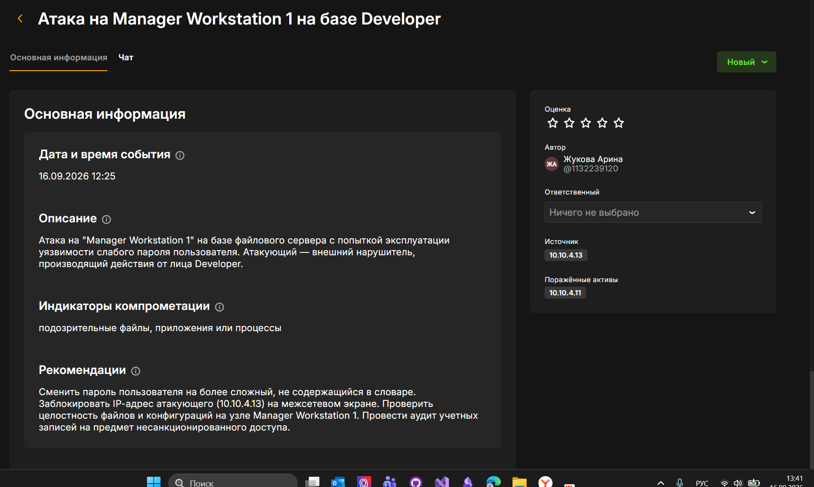{#fig:044 width=90%} 

Инцидент 2. «Атака на Developer на базе Kali» (автор — Садова Диана, 16.09.2026 12:26). Описание: атака на рабочую станцию Developer с внешнего устройства злоумышленника под управлением Kali Linux, направленная на узел Manager Workstation 1. Источник — 195.239.174.11 (Kali), поражённый актив — 10.10.4.11 (Manager Workstation 1). Рекомендации: смена пароля, проверка целостности файлов узла Developer, аудит учётных записей (рис. [-@fig:045]).

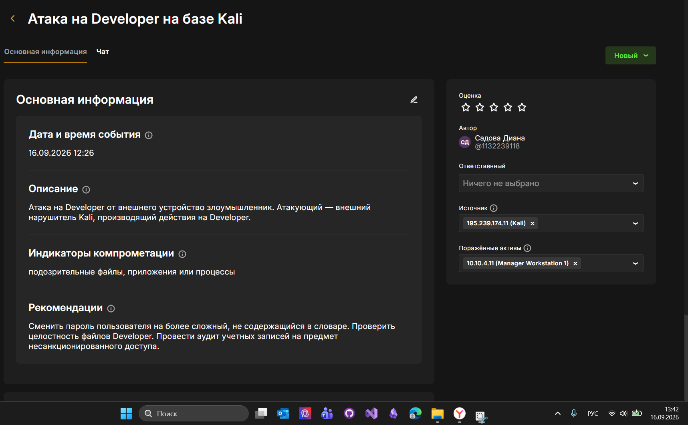{#fig:045 width=90%} 

Инцидент 3. «Атака на веб-сервер redmine.ampire.corp с попыткой эксплуатации уязвимости SQL-инъекции» (автор — Жукова Арина, 16.09.2026 12:25). Описание: атака на веб-сервер redmine.ampire.corp на базе Redmine с попыткой эксплуатации SQL-инъекции; атакующий — внешний нарушитель, использующий автоматизированный инструмент python-requests/2.31.0. Источник — 10.10.4.11, поражённый актив — 10.10.2.15. Индикаторы компрометации: подозрительные приложения (использование python-requests/2.31.0), аномально высокое количество обращений к одному файлу. Рекомендации: блокировка IP-адреса атакующего, проверка веб-сервера на наличие уязвимостей SQL-инъекций, обновление Redmine и его компонентов, аудит логов веб-сервера и базы данных, усиление валидации входных данных на стороне сервера (рис. [-@fig:046]).

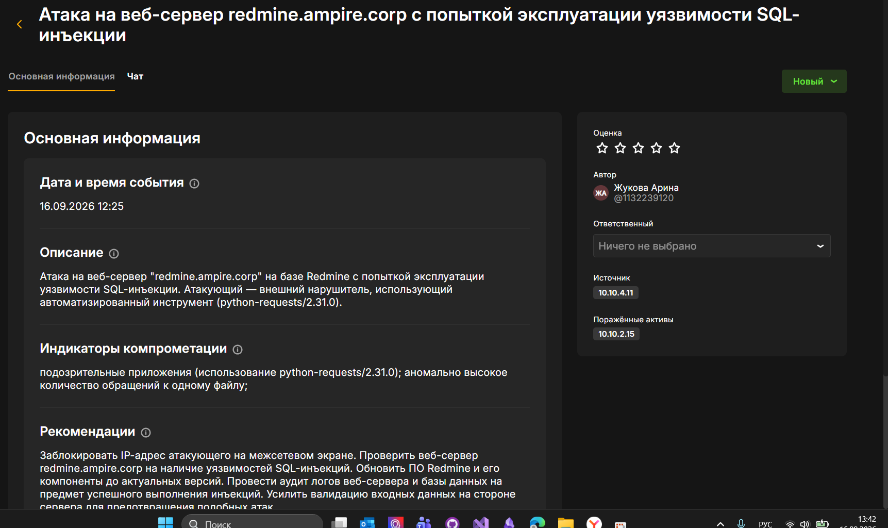{#fig:046 width=90%} 

Инцидент 4. «Атака Blind SQL-инъекция на сервере Redmine» (автор — Садова Диана, 16.09.2026 12:25). Описание: эксплуатируемая уязвимость — CVE-2019-18890 (Redmine до версии 3.2.9 и 3.3.x до версии 3.3.10); атакующий — внутренний нарушитель. Зафиксированные события: ET WEB_SERVER Possible SQL Injection Attempt SELECT FROM и ET WEB_SERVER SQL Injection Select Sleep Time Delay. Источник — 10.10.4.11 (Manager Workstation 1), поражённый актив — 10.10.2.15 (Redmine Server). Индикатор компрометации: аномально высокое количество обращений к одному файлу. Рекомендации: внести изменения в код Redmine — найти обработку параметра subproject_id в файле query.rb (директория /var/www/redmine/app/models), добавить фильтрацию значений параметра и закомментировать уязвимый участок кода (рис. [-@fig:047]).

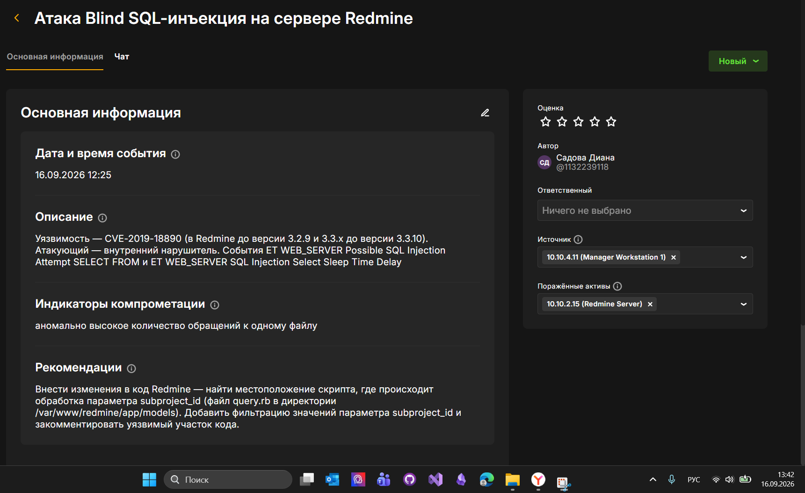{#fig:047 width=90%} 

# Вывод 

По результатам анализа событий ViPNet IDS NS и регистрации инцидентов подтверждён факт многоэтапной атаки на инфраструктуру Ampire, соответствующей описанию Сценария №5, а также зафиксированы конкретные рекомендации по устранению каждой из выявленных уязвимостей.

::: {#refs}
:::
