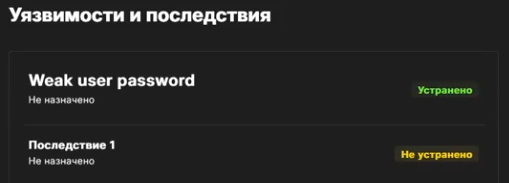
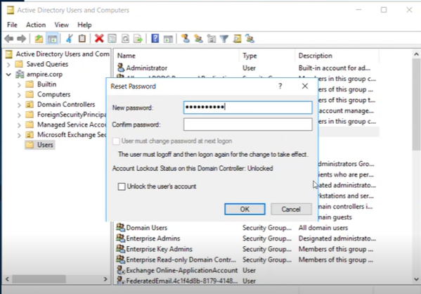
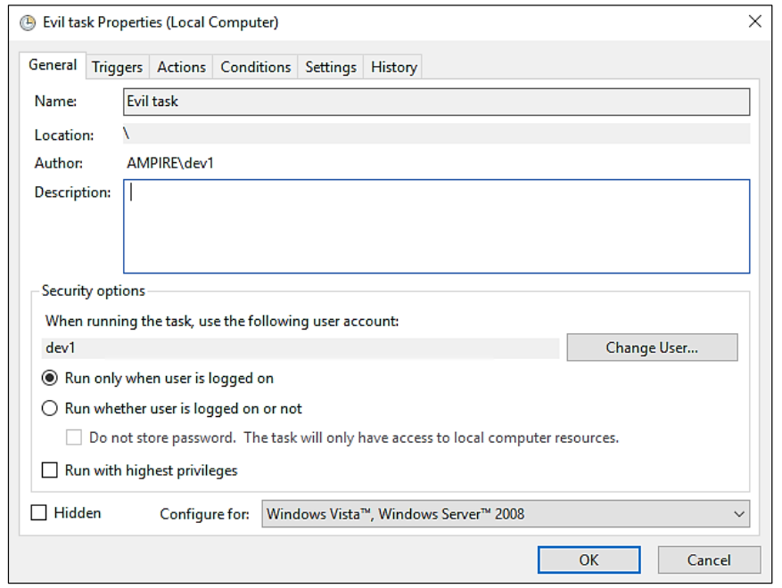
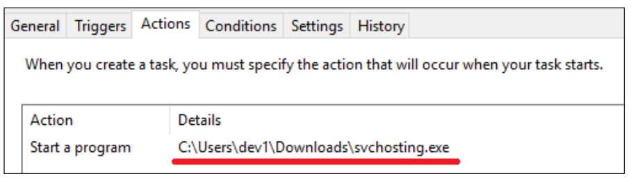
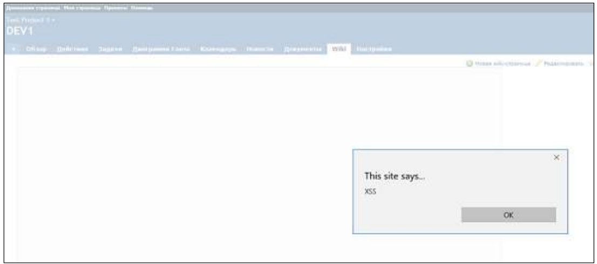
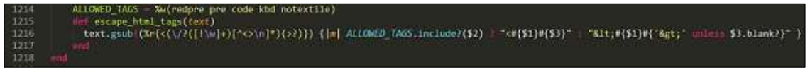
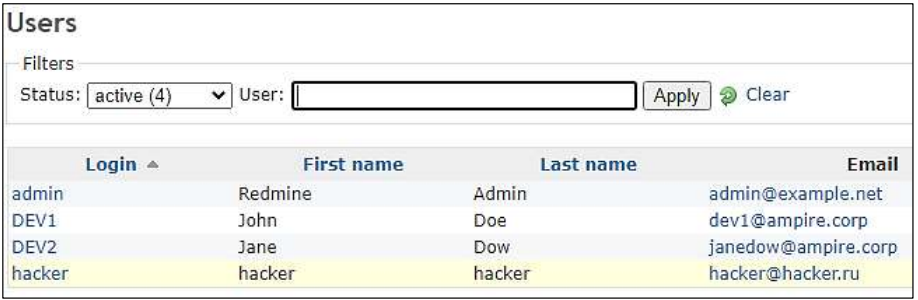
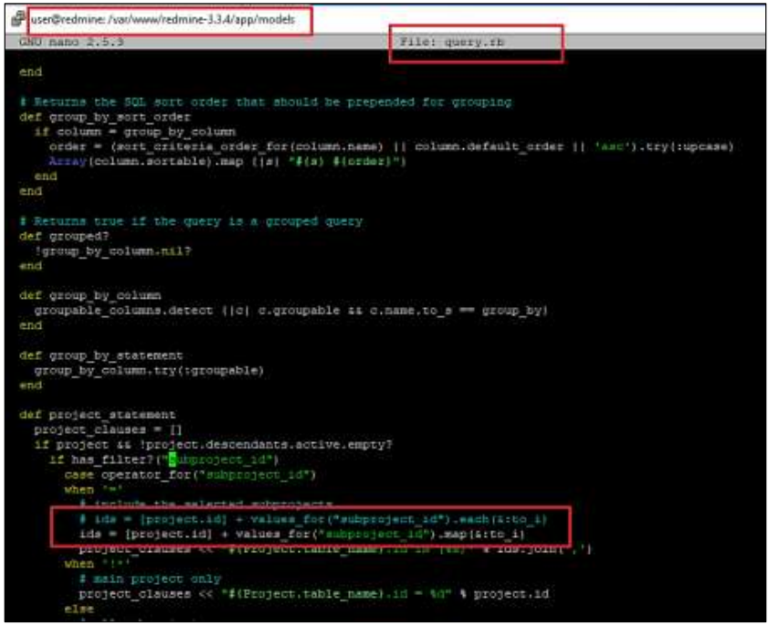

# Описание сценария

Последовательность действий нарушителя следующая:

1) Внутренний нарушитель подбирает пароль на файловый сервер и меняет существующий на сервере файл другим файлом с backdoor (дефектом алгоритма).

2) Пользователь Dev-1 загружает и запускает файл с backdoor.

3) Внутренний нарушитель получает контроль над компьютером пользователя Dev-1 и загружает скрипт для похищения учетных данных из браузера. Запускает данный скрипт и получает логин - пароль к Redmine.

4) Внутренний нарушитель проводит атаку stored XSS для включения на Redmine сервере REST API. Вредоносный код записывается на Wiki-страницу проекта Dev1. Получив доступ к консоли администратора, внутренний нарушитель создает нового пользователя Redmine с правами администратора.

5) Внутренний нарушитель ожидает, когда администратор просмотрит страницу с внедренным вредоносным кодом.

6) Внутренний нарушитель проводит Blind SQL-инъекцию, получает доступ к данным конфиденциального проекта.

Ниже представлена логическая схема сценария № 5 «Защита научно-технической информации предприятия», красными стрелками обозначены вредоносные действия нарушителя, а зелеными – легитимные действия любого пользователя (рис. [-@fig:001]).

{#fig:001 width=90%}

# Перечень уязвимостей и последствий

Для сценария № 5 «Защита научно-технической информации предприятия» определены три уязвимости и два последствия:

1) Уязвимость 1. Слабый пароль пользователя.

2) Последствие. Developer backdoor.

3) Уязвимость 2. XSS (CVE-2019-17427).

4) Последствие. Redmine User.

5) Уязвимость 3. Blind SQL (CVE-2019-18890).

## Уязвимость 1. Слабый пароль пользователя.

На файловом сервере установлен слабый пароль для входа, что позволяет нарушителю перебрать данный пароль со словарем. После успешной авторизации на файловом сервере нарушитель загружает .bat файл и получает доступ к учетным данным пользователя dev1.

**Решение:** для закрытия уязвимости необходимо изменить пароль на более сложный, не содержащийся в словаре. Для изменения пароля на сервере AD открыть «Active Directory Users and Computers», найти пользователя dev1, нажать на «Reset Password» (Рисунок 2) и ввести новый пароль.(рис. [-@fig:002]).

{#fig:002 width=90%}

После изменения пароля пользователя dev1 уязвимость успешно устранена.(рис. [-@fig:003]).

{#fig:003 width=90%}

Что было сделанно:

1) Переходим на удаленный рабочий стол для измененя пароля пользователя «10.10.2.10 – Remote Desktop Connection» (рис. [-@fig:017]).

{#fig:017 width=90%}

2) Окно Active Directory Users and Computers развёрнуто дерево ampire.corp → Users; в списке — Administrator, Allowed RODC Password Replication, Cert Publishers, CloneableDomainControllers, DefaultAccount, dev1, dev2, DiscoverySearchMailbox, DnsAdmins и т.д.(рис. [-@fig:018]).

{#fig:018 width=90%}

3) Правым кликом вызвано контекстное меню, выбран пункт «Reset Password…» → открылось одноимённое модальное окно с полями «New password», «Confirm password», флажком «User must change password at next logon» и статусом «Account Lockout Status on this Domain Controller Unlocked». В поле New password вводится новый пароль (9 символов).(рис. [-@fig:019]).

{#fig:019 width=90%}

## Последствие. Developer backdoor.

Нарушитель может создать сервис, автоматически запускающий исполняемый файл, который устанавливает Reverse Shell подключение. Новая задача, записанная нарушителем, находится на узле Developer 1 (10.10.4.13) в планировщике задач. (рис. [-@fig:004]).

{#fig:004 width=90%} 

В созданной задаче можно обнаружить запуск файла во вкладке «Action» svchosting.exe (рис. [-@fig:005]).

{#fig:005 width=90%} 

Для устранения полезной нагрузки необходимо удалить задачу из планировщика задач и файл из директории.

Что было сделанно:

1) Новое RDP‑подключение к Developer Workstation 1 (10.10.4.13) (рис. [-@fig:020]).

{#fig:020 width=90%}

2) Открыть Task Scheduler, вкладка Task Scheduler Library в списке заданий — «Evil task» (рис. [-@fig:021]).

{#fig:021 width=90%}

3) 

## Уязвимость 2. XSS (CVE-2019-17427).

Эксплуатируемая уязвимость – CVE-2019-17427.

В Redmine до версии 3.4.11 и 4.0.x до версии 4.0.4 постоянный XSS существует из-за ошибок форматирования при работе с textile текстом. В данном сценарии используется для включения REST API для эксплуатации следующей уязвимости (рис. [-@fig:007]), (рис. [-@fig:008]),(рис. [-@fig:009]).

{#fig:007 width=90%} 

{#fig:008 width=90%} 

{#fig:009 width=90%} 

**Решение:** внести изменения в код Redmine.

Необходимо найти обработку текста wiki-страницы при наличии в тексте html-тегов. Из описания уязвимости понятно, что необходимо найти библиотеку для преобразования textile разметки в html. В Redmine за данное преобразование отвечает Redcloth (файл redcloth3.rb в папке /var/www/redmine/lib). В redcloth3.rb представляют интерес следующие строки (рис. [-@fig:010]).

{#fig:010 width=90%} 

Далее можно удалить тег pre из разрешенных тегов, которые не будут экранированы. Необходимо рассмотреть закрытие уязвимости разработчиками – в репозитории Redmine на Github зайти в Releases и сравнить исправленную версию с уязвимой. В файле redcloth3.rb разработчики внесли следующие изменения (рис. [-@fig:011]), (рис. [-@fig:012]),(рис. [-@fig:013]).

{#fig:011 width=90%} 

{#fig:012 width=90%} 

{#fig:013 width=90%}

После внесения изменений необходимо перезапустить службу веб-сервера: sudo systemctl restart nginx.service.

Что было сделанно:

## Последствие. Redmine User.

Данная полезная нагрузка заключается в том, что нарушитель создает пользователя на портале Redmine. Пользователь, обладающий правами администратора, имеет неограниченный доступ к пользовательской базе.

**Примечание:** способ закрытия полезной нагрузки «Redmine User» не будет действовать до внесения изменений по закрытию уязвимости «Атака XSS»

Для обнаружения добавления нового привилегированного пользователя, достаточно зайти в консоль администратора Redmine по ссылке (http://redmine.ampire.corp/login), перейти в раздел «Administration» – «Users» и посмотреть список существующих пользователей (рис. [-@fig:014]).

{#fig:014 width=90%} 

Для нейтрализации полезной нагрузки необходимо удалить созданного пользователя «hacker» через веб-интерфейс Redmine (рис. [-@fig:015]).

{#fig:015 width=90%}

В результате удаления созданного пользователя «hacker» успешно нейтрализовано последствие Redmine User.

Что было сделанно:

## Уязвимость 3. Blind SQL (CVE-2019-18890).

Эксплуатируемая уязвимость – CVE-2019-18890.

В Redmine до версии 3.2.9 и 3.3.x до версии 3.3.10 уязвимость позволяет пользователям Redmine получать доступ к защищенной информации с помощью сгенерированного объектного запроса. Уязвимость реализуется посимвольным перебором с замером времени ответа. В данном сценарии данная уязвимость используется для получения конфиденциальной информации из БД, минуя разграничение доступа Redmine (рис. [-@fig:016]),(рис. [-@fig:017]).

Время прихода пакета является индикатором: при запоздании пакета – символ подобран верно, иначе – перебор продолжается.

{#fig:016 width=90%} 

{#fig:017 width=90%}

**Решение:** внести изменения в код Redmine.

Исходя из адреса и запроса следует найти местоположение скрипта, где происходит обработка параметра subproject_id. В данном случае рассмотрен файл query.rb. Данный файл находится в директории /var/www/redmine/app/models (рис. [-@fig:018]).

{#fig:018 width=90%}

Из вышеупомянутого рисунка следует, что выделенный участок кода отвечает за передачу значений в запрос в случае наличия параметра subproject_id. В данном случае следует добавить фильтрацию значений и закомментировать код.

После внесения изменений необходимо перезапустить службу веб-сервера: sudo systemctl restart nginx.service.

Что было сделанно:

# Мониторинг 

В процессе мониторинга, наша команда пыталась опрелить какие системы были затронуты нарушителем, что выдавало его присутствие большим числом откликов и связей между собой. У нас получилось установить 4 отчета мониторинга системы: от момета как нарушитель попал в систему, до описания всех уезвимостей что были в системе.

# Вывод 

::: {#refs}
:::
